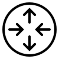
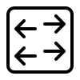

# Networking
People have entire careers devoted to connecting the systems all around us. That job is no small task and in this section we talk about the intricacies of the bits that travel around us every day.

## Questions
### 01-N-E4GF4
[Easy] What is the primary goal of a network?
1. **[correct] To make programs, data and equipment available to those in need of the services.**
2. Allows cellphones to connect to eachother.
3. Prevent users from allowing people to access their computers in an unauthorized way.
4. To provide power to all devices in a general area.

Explanation: https://fcit.usf.edu/network/chap1/chap1.htm

### 01-N-29S08
[Easy] What device is the "conductor" and tells packets how to get where they want to go?
1. SSD
2. Hub
3. Firewall
4. **[correct] Router**

Explanation: https://www.cisco.com/c/en/us/solutions/small-business/resource-center/networking/what-is-a-router.html

### 01-N-CDWJU
[Medium] Which of these graphics represents a network switch in a topology diagram?
1. 
2. 
3. **[correct] **
4. 

Explanation: https://www.cisco.com/c/dam/en_us/training-events/netacad/demos/FNSDemo1_1/ch1/1_1_1/1_1_1GraphicsSymbols.pdf

### 01-N-DR1ZF
[Medium] What tool can an attacker use to identify hosts on an unknown network?
1. sed
2. **[correct] nmap**
3. grep
4. burp

Explanation: https://nmap.org/

### 01-N-4RUAT
[Hard] Without a router, which of the following local addresses can talk to 192.168.1.17/25?
1. 172.12.2.23
2. 192.168.1.254
3. **[correct] 192.168.1.112**
4. 10.0.0.23

Explanation: https://study-ccna.com/variable-length-subnet-mask-vlsm/
